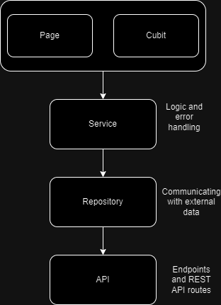

# MyPayments

## Docs
This app uses 3 libraries: 
1. flutter_bloc -> State management library
2. get_it -> Dependency injection library
3. result_dart -> Result treatment library 

## Architecture


To run with some data already filled, run
```
flutter run --dart-define useTestData=true
```
